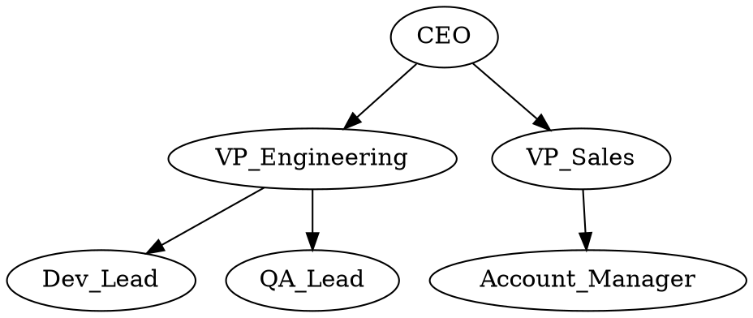

# Popular JavaScript Libraries for Graph Visualization

Choosing the right JavaScript library for graph visualization can make the difference between a weekend project and a months-long slog. This appendix covers the history of graph visualization tooling, then surveys the modern JavaScript libraries that are purpose-built for drawing graph networks — with honest assessments of their strengths, weaknesses, and intended audiences.

---

## History of Graph Visualization

### The Graphviz Era at Bell Labs

The story of automated graph visualization begins at AT&T Bell Labs in the early 1990s. Researchers [Stephen North](https://www.linkedin.com/in/scnorth/), Emden Gansner, Eleftherios Koutsofios, and others developed **Graphviz** — a suite of command-line tools for drawing graphs from a simple text description. The project grew out of practical needs: Bell Labs engineers were building large software systems and needed ways to visualize call graphs, dependency trees, and state machines without manually positioning hundreds of nodes.

The key innovation was the **DOT language** — a plain-text format for describing graphs that separates the *structure* of a graph from its *visual layout*. A minimal DOT file looks like this:

This declarative approach was groundbreaking. Instead of specifying pixel coordinates for every node, you described the relationships and let the layout engine handle positioning. Graphviz included several layout engines, each optimized for different graph structures:

| Engine | Layout Style | Best For |
|--------|-------------|----------|
| **dot** | Hierarchical (layered) | Directed graphs, org charts, dependency trees |
| **neato** | Force-directed (spring model) | Undirected graphs, network maps |
| **fdp** | Force-directed (Fruchterman-Reingold) | Large undirected graphs |
| **circo** | Circular | Ring structures, cyclic graphs |
| **twopi** | Radial | Trees radiating from a central root |
| **sfdp** | Scalable force-directed | Very large graphs (thousands of nodes) |

Graphviz was released as open source in the early 2000s and became the de facto standard for static graph rendering. Its influence was enormous — the DOT language became a universal interchange format, and virtually every graph visualization tool that followed either supported DOT input or was directly inspired by its design philosophy.

### From Static to Interactive

Graphviz produces static images — PNG, SVG, PDF. For decades, that was sufficient. But as the web matured and browsers gained the ability to run complex JavaScript, a new generation of tools emerged that could render graphs *interactively* in the browser. Users could zoom, pan, drag nodes, hover for details, and filter in real time.

This shift from static rendering to interactive exploration transformed graph visualization from a developer tool into an analytical tool. The libraries below represent the current state of the art for drawing graph networks in the browser.

---

## Modern JavaScript Libraries

### vis-network

**Website:** [https://visjs.github.io/vis-network/](https://visjs.github.io/vis-network/)

vis-network is a graph visualization library that emphasizes ease of use and interactive exploration. Originally part of the vis.js project created by Almende B.V., it is now maintained by the open-source community. It renders on an HTML5 Canvas and includes a built-in physics engine for force-directed layouts.

**Pros:**

- Very low barrier to entry — a working graph visualization in under 20 lines of code
- Built-in physics simulation with multiple solver options (Barnes-Hut, Forceatlas2, Repulsion)
- Rich interaction out of the box: drag nodes, zoom, pan, hover tooltips, click events
- Supports hierarchical, force-directed, and manual layouts
- Good documentation with many examples
- Handles hundreds to low thousands of nodes comfortably

**Cons:**

- Canvas rendering means no CSS styling of individual elements (unlike SVG-based libraries)
- Performance drops noticeably above 2,000-3,000 nodes
- Limited customization of edge routing and curvature
- Community-maintained; development pace is slower than commercially backed alternatives
- Known rendering quirk with edge labels on perfectly horizontal edges

**Intended audience:** Analysts, educators, and developers who need interactive graph visualizations without deep frontend expertise. Excellent for prototyping, dashboards, and educational tools.

**Used in this course:** vis-network powers many of the MicroSims throughout this textbook, including the learning graph viewer, org chart visualizations, and network analysis demonstrations.

---

### D3.js (d3-force)

**Website:** [https://d3js.org/](https://d3js.org/)

D3.js is a general-purpose data visualization library, not a graph-specific tool. However, its `d3-force` module provides a flexible force-directed simulation that serves as the foundation for many custom graph visualizations. D3 renders to SVG (or Canvas), giving developers pixel-level control over every visual element.

**Pros:**

- Maximum flexibility — every aspect of the visualization is customizable
- SVG rendering allows CSS styling, transitions, and animations on individual elements
- Massive ecosystem with thousands of examples and community extensions
- The `d3-force` simulation is highly configurable (custom forces, collision detection, centering)
- Integrates naturally with other D3 modules for axes, tooltips, legends, and brushing
- Excellent for publication-quality and bespoke visualizations

**Cons:**

- Steep learning curve — D3 is a low-level toolkit, not a charting library
- You must build interaction (drag, zoom, tooltips) yourself from primitives
- No built-in hierarchical or circular graph layouts (you compose them from modules)
- SVG performance degrades with thousands of elements; Canvas rendering requires more manual work
- Significant development time for anything beyond a basic force layout

**Intended audience:** Frontend developers and data visualization specialists who need full creative control and are comfortable writing substantial JavaScript. D3 is the right choice when you need a visualization that doesn't look like any existing template.

---

### Cytoscape.js

**Website:** [https://js.cytoscape.org/](https://js.cytoscape.org/)

Cytoscape.js is a graph theory library purpose-built for graph analysis and visualization. It originated as the JavaScript companion to Cytoscape, a desktop application widely used in bioinformatics for visualizing molecular interaction networks. Cytoscape.js provides both a rendering engine and a graph analysis API with built-in algorithms.

**Pros:**

- Purpose-built for graphs — the data model, API, and rendering are all graph-native
- Extensive built-in layout algorithms: force-directed (CoSE), hierarchical, grid, circle, concentric, breadthfirst, and more
- Built-in graph analysis: BFS, DFS, Dijkstra, PageRank, betweenness centrality, community detection
- Rich styling system inspired by CSS selectors (style nodes/edges by property values)
- Supports both Canvas and WebGL rendering (via extensions)
- Active development with strong academic and community backing
- Handles medium to large graphs (thousands of nodes)

**Cons:**

- The API has a learning curve — graph-specific query syntax takes time to master
- Default visual aesthetics are functional rather than polished
- Heavier bundle size than minimal alternatives
- Some advanced layouts require separate extension packages
- Less general-purpose than D3 — harder to combine with non-graph visualizations

**Intended audience:** Developers and researchers building graph-centric applications where analysis and visualization are equally important. Especially strong in bioinformatics, knowledge graphs, and network science. A good choice when you need built-in graph algorithms alongside visualization.

---

### Sigma.js

**Website:** [https://www.sigmajs.org/](https://www.sigmajs.org/)

Sigma.js is a graph visualization library focused on rendering large graphs efficiently using WebGL. It is designed as the web rendering companion to Gephi, the popular open-source desktop tool for network analysis.

**Pros:**

- WebGL rendering enables smooth interaction with tens of thousands of nodes
- Optimized specifically for large graph rendering — this is its primary design goal
- Clean, minimal API focused on rendering (not analysis)
- Works well as a display layer for graphs analyzed in Gephi or other tools
- Supports node and edge programs for custom WebGL shaders
- Lightweight compared to full-featured alternatives

**Cons:**

- Minimal built-in interaction — you build selection, hover, and filtering yourself
- No built-in graph algorithms (purely a rendering library)
- Limited layout options out of the box — typically you precompute positions externally
- WebGL dependency means it won't work in all environments (e.g., some server-side rendering)
- Smaller community and fewer examples than D3 or Cytoscape.js

**Intended audience:** Developers who need to render large graphs (10,000+ nodes) in the browser with high performance. Best used when positions are precomputed by an external tool like Gephi or a server-side layout engine.

---

### G6 (AntV)

**Website:** [https://g6.antv.antgroup.com/](https://g6.antv.antgroup.com/)

G6 is a graph visualization framework developed by Ant Group (the company behind Ant Design and AntV). It provides both a rendering engine and a rich set of built-in layouts, interactions, and analysis features. G6 renders to Canvas and supports WebGL for large graphs.

**Pros:**

- Comprehensive built-in layouts: force, hierarchical (Dagre), radial, concentric, grid, circular, and more
- Built-in interaction behaviors: drag, zoom, brush select, edge creation, minimap
- Tree graph support with expand/collapse for hierarchical data
- Built-in graph analysis utilities (GADDI subgraph matching, community detection)
- Polished default aesthetics with animation support
- Active development with regular releases

**Cons:**

- Documentation was historically Chinese-first; English docs have improved but gaps remain
- Large bundle size due to comprehensive feature set
- API conventions differ from Western JavaScript ecosystem norms
- Smaller Western community means fewer Stack Overflow answers and English tutorials
- Some features feel enterprise-oriented and may be more than needed for simple use cases

**Intended audience:** Enterprise developers building complex graph applications such as knowledge graphs, fraud detection networks, or organizational charts. Especially strong if you are already in the Ant Design/AntV ecosystem.

---

### Reagraph / react-force-graph

**React-specific options**

For teams building React applications, several libraries wrap graph rendering in React components:

- **react-force-graph** ([https://github.com/vasturiano/react-force-graph](https://github.com/vasturiano/react-force-graph)) — A React wrapper around force-graph (2D/3D/VR). Uses Canvas/WebGL and handles very large graphs. Good for immersive 3D graph exploration.
- **Reagraph** ([https://reagraph.dev/](https://reagraph.dev/)) — A WebGL-powered React graph library with built-in layouts and interactions. Designed for React-first development with modern hooks-based API.

These are worth considering if your application is already React-based and you want graph visualization to integrate as a native component rather than a standalone canvas.

---

## Library Comparison Summary

| Library | Renderer | Layout Engines | Graph Analysis | Performance Ceiling | Learning Curve |
|---------|----------|---------------|----------------|-------------------|---------------|
| **vis-network** | Canvas | Force, hierarchical, manual | None | ~2,000 nodes | Low |
| **D3.js** | SVG/Canvas | Force (d3-force), composable | None (build your own) | ~5,000 nodes (SVG) | High |
| **Cytoscape.js** | Canvas/WebGL | Many built-in | Extensive | ~5,000 nodes | Medium |
| **Sigma.js** | WebGL | External (precomputed) | None | ~50,000+ nodes | Medium |
| **G6** | Canvas/WebGL | Many built-in | Some built-in | ~10,000 nodes | Medium |

---

## Choosing a Library

If you're not sure where to start, consider these decision points:

- **"I need something working in an hour"** — vis-network
- **"I need full creative control over every pixel"** — D3.js
- **"I need graph algorithms and visualization together"** — Cytoscape.js
- **"I need to render a massive graph smoothly"** — Sigma.js
- **"I'm building an enterprise React application"** — G6 or react-force-graph

For the organizational analytics work in this course, vis-network provides the best balance of simplicity, interactivity, and capability. It gets out of the way and lets you focus on the data — which is exactly where your attention should be.

---

## Further Reading

- Graphviz documentation: [https://graphviz.org/documentation/](https://graphviz.org/documentation/)
- Gansner, E. R. and North, S. C. (2000). "An Open Graph Visualization System and Its Applications to Software Engineering." *Software: Practice and Experience*, 30(11), 1203-1233.
- vis-network documentation: [https://visjs.github.io/vis-network/docs/network/](https://visjs.github.io/vis-network/docs/network/)
- Cytoscape.js documentation: [https://js.cytoscape.org/](https://js.cytoscape.org/)
- Sigma.js documentation: [https://www.sigmajs.org/](https://www.sigmajs.org/)
