# List of MicroSims for Organizational Analytics

Interactive Micro Simulations to help students learn organizational analytics fundamentals.
These 69 MicroSims cover graph databases, network analysis, NLP, machine learning,
and organizational insights using interactive visualizations.

-   **[AI Content Detection Pipeline](./ai-content-detection/index.md)**

    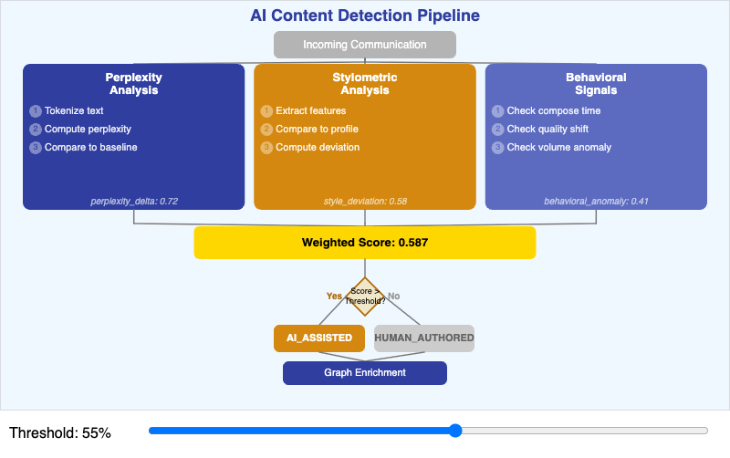

    Interactive flowchart showing three parallel detection paths (perplexity, stylometric, behavioral) converging to classify communications as AI-assisted or human-authored.

-   **[Alert System Architecture](./alert-system-architecture/index.md)**

    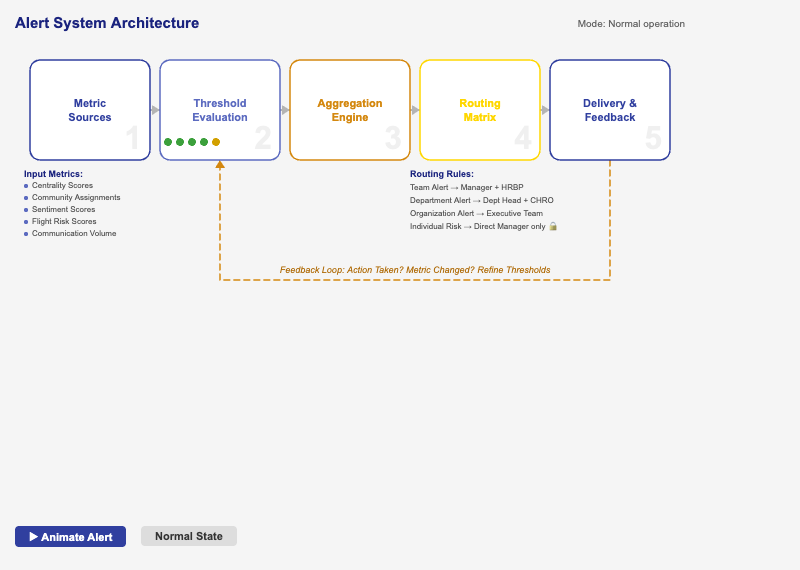

    Interactive five-stage pipeline diagram showing how graph metrics flow through threshold evaluation, aggregation, routing, and feedback loops to generate actionable organizational alerts.

-   **[Batch vs Stream Processing](./batch-vs-stream/index.md)**

    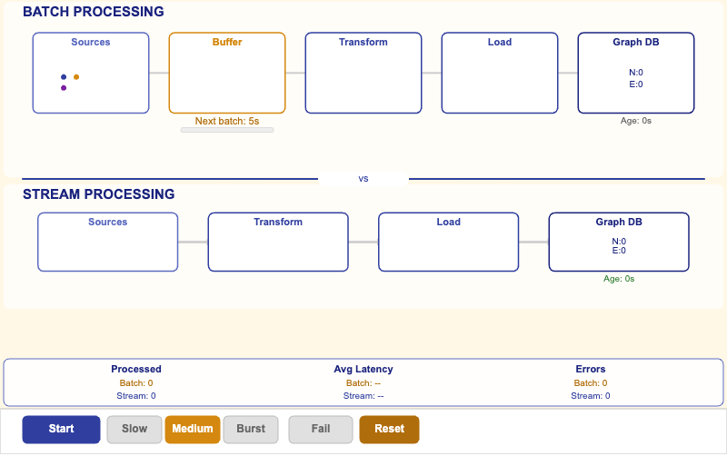

    Interactive split-screen simulation comparing batch and stream processing pipelines side by side, showing trade-offs in freshness, latency, and error handling.

-   **[BFS vs DFS Traversal Animator](./bfs-vs-dfs/index.md)**

    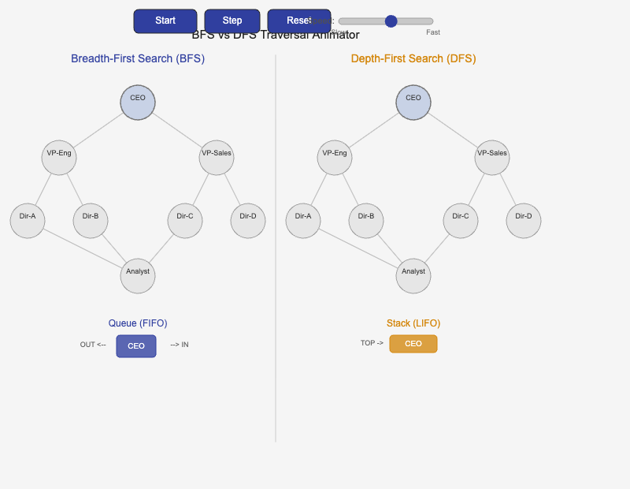

    Side-by-side animated comparison of breadth-first search and depth-first search traversal order.

-   **[Bias Feedback Loop](./bias-feedback-loop/index.md)**

    

    Interactive diagram showing how ML bias self-reinforces through a four-stage circular feedback loop, with intervention strategies to break the cycle.

-   **[Career Path Explorer](./career-path-explorer/index.md)**

    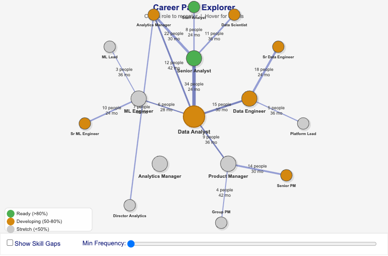

    Interactive radial graph visualization of career mobility paths with skill readiness scoring, historical transition frequency, and two-hop role exploration.

-   **[Capstone Project Component Map](./capstone-component-map/index.md)**

    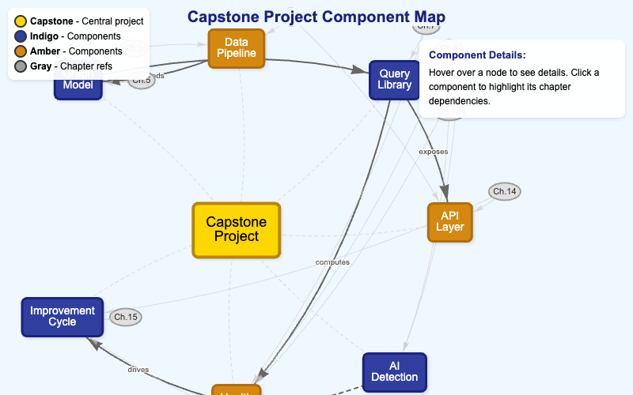

    Interactive vis-network concept map showing seven capstone project components, their chapter dependencies, and inter-component relationships.

-   **[Centrality Algorithm Decision Tree](./centrality-decision-tree/index.md)**

    

    Interactive decision tree for selecting the most appropriate centrality or pathfinding algorithm.

-   **[Centrality Comparison Dashboard](./centrality-comparison/index.md)**

    

    Side-by-side comparison of degree, betweenness, and closeness centrality on the same organizational network.

-   **[Centrality Equity Dashboard](./centrality-equity-dashboard/index.md)**

    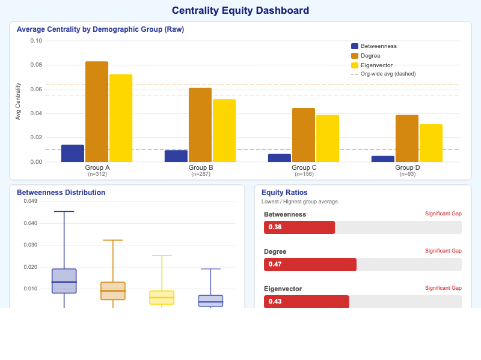

    Interactive three-panel dashboard showing centrality metric distributions across demographic groups with equity ratio indicators.

-   **[Communication Tone Radar](./tone-radar/index.md)**

    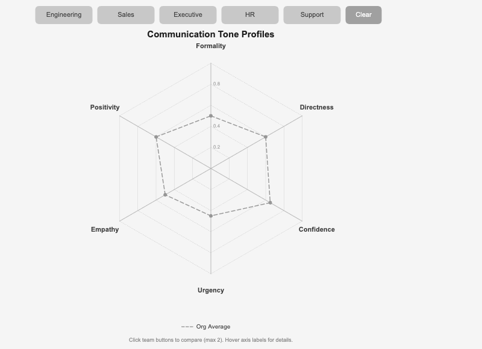

    Interactive radar chart comparing multi-dimensional communication tone profiles across organizational teams.

-   **[Complete Event Stream Pipeline](./event-stream-pipeline/index.md)**

    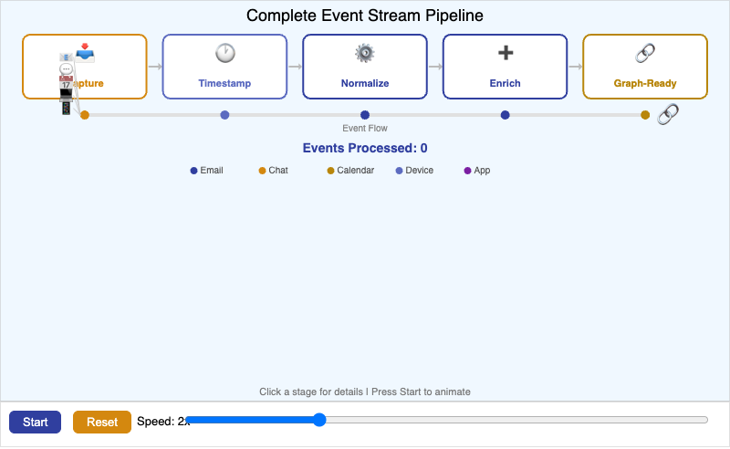

    End-to-end animated visualization of the 5-stage event stream pipeline from capture through graph preparation.

-   **[Continuous Improvement Cycle](./continuous-improvement-cycle/index.md)**

    

    Interactive circular diagram showing the four-phase continuous improvement cycle with Measure, Analyze, Intervene, and Evaluate phases, example scenarios, and rotating animation.

-   **[Course Journey Map](./course-journey-map/index.md)**

    

    Interactive roadmap showing the five major phases of the Organizational Analytics course, from Foundations through Application.

-   **[Cypher Query Visualizer](./cypher-query-visualizer/index.md)**

    

    Interactive tool for executing Cypher query patterns against a sample organizational graph.

-   **[Data Ingestion Pipeline Architecture](./data-ingestion-pipeline/index.md)**

    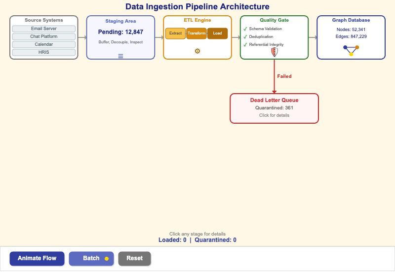

    Interactive visualization of the end-to-end data ingestion pipeline from source systems through staging, ETL, quality gates, and graph database loading.

-   **[Data Quality Check Framework](./data-quality-checks/index.md)**

    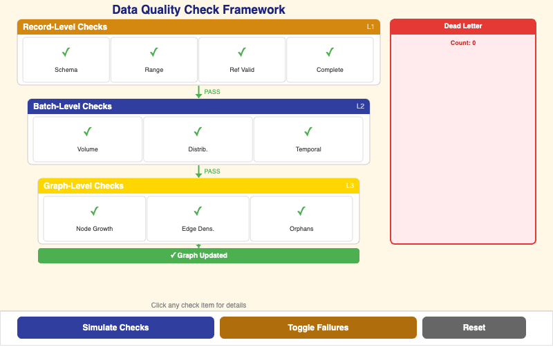

    Interactive three-tier quality check visualization showing record-level, batch-level, and graph-level data validation with dead letter queue routing.

-   **[Deduplication Pipeline](./dedup-pipeline/index.md)**

    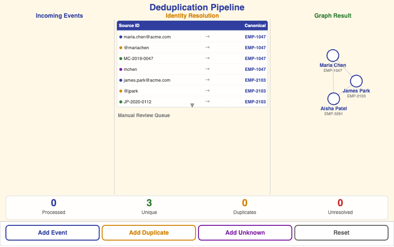

    Interactive simulation showing how events from multiple source systems with different identifiers are resolved through identity resolution into canonical graph nodes.

-   **[Degree Centrality Explorer](./degree-centrality-explorer/index.md)**

    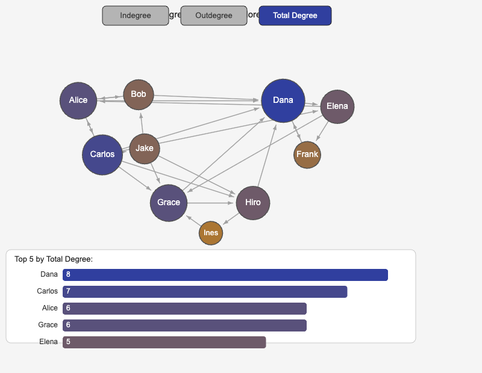

    Interactive visualization comparing indegree, outdegree, and total degree centrality in an organizational communication network.

-   **[Directed vs Undirected Graph](./directed-vs-undirected/index.md)**

    

    Interactive comparison showing how edge direction conveys meaning in organizational graph models.

-   **[End-to-End Analytics Pipeline](./end-to-end-pipeline/index.md)**

    

    Interactive pipeline diagram showing six stages of organizational analytics from raw event ingestion through insight delivery with a continuous feedback loop.

-   **[ETL Event-to-Graph Transform](./etl-event-to-graph/index.md)**

    

    Interactive step-through visualization showing how a single raw event record is decomposed into graph nodes and edges during ETL transformation.

-   **[Event Log Anatomy](./event-log-anatomy/index.md)**

    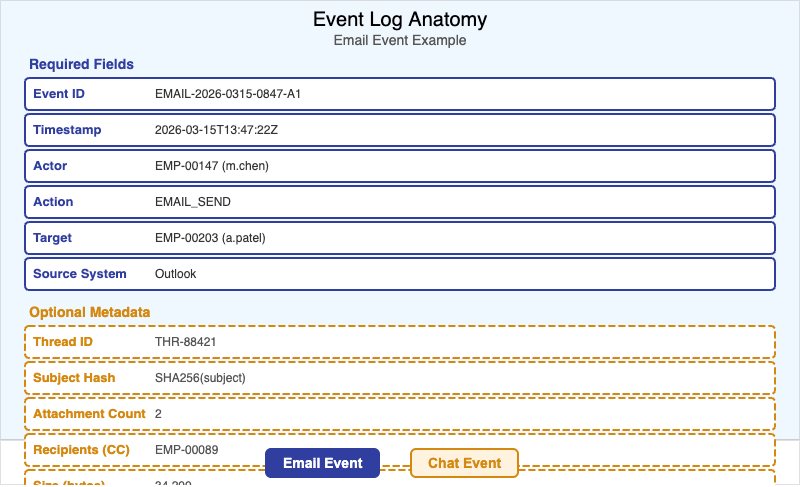

    Interactive diagram showing the anatomy of a single event log record with required and optional fields, with toggle between Email and Chat event examples.

-   **[Event Source Taxonomy](./event-source-taxonomy/index.md)**

    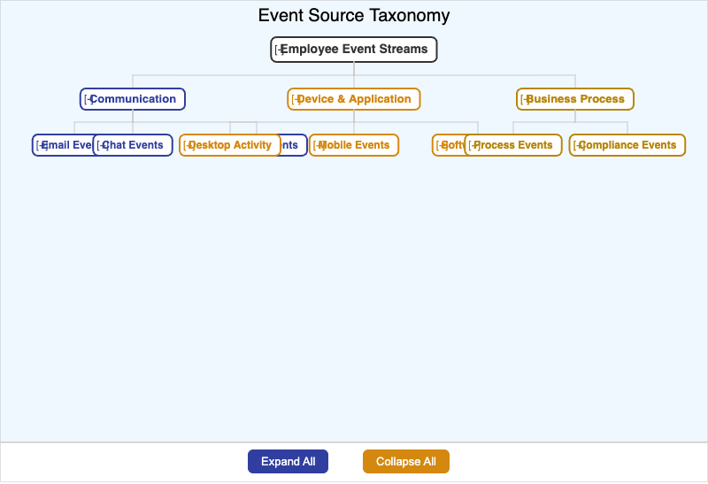

    Interactive hierarchical tree diagram showing the taxonomy of organizational event sources with expandable branches and hover tooltips.

-   **[Executive Dashboard](./executive-dashboard/index.md)**

    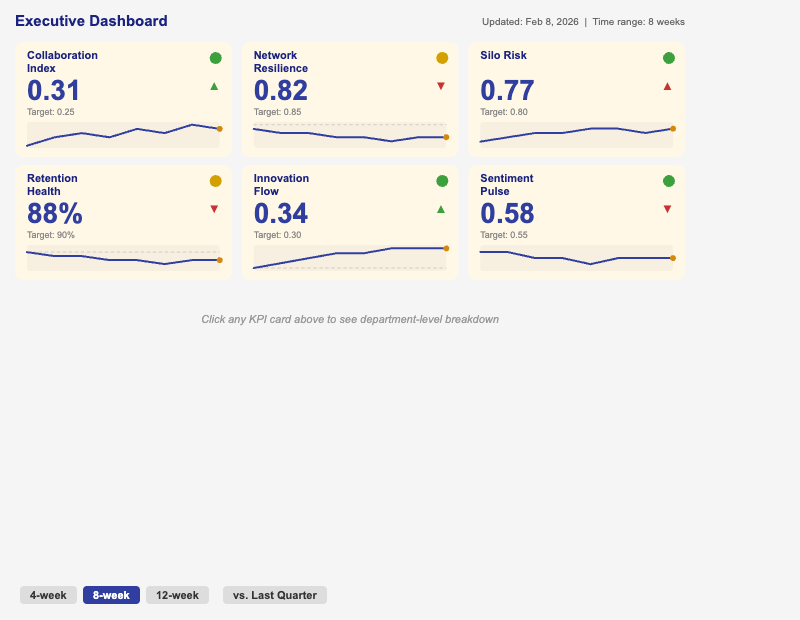

    Six-KPI executive dashboard with sparkline trends, drill-down department breakdowns, and color-coded status indicators following progressive disclosure principles.

-   **[GNN Message Passing](./gnn-message-passing/index.md)**

    

    Animated visualization of Graph Neural Network message passing on a small organizational network.

-   **[Graph Library Architecture](./graph-library-architecture/index.md)**

    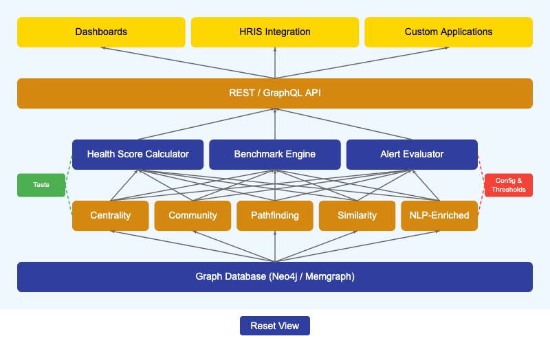

    Interactive layered architecture diagram showing five tiers of an organizational analytics graph library from database to consumers.

-   **[Graph Scalability Strategies](./graph-scalability/index.md)**

    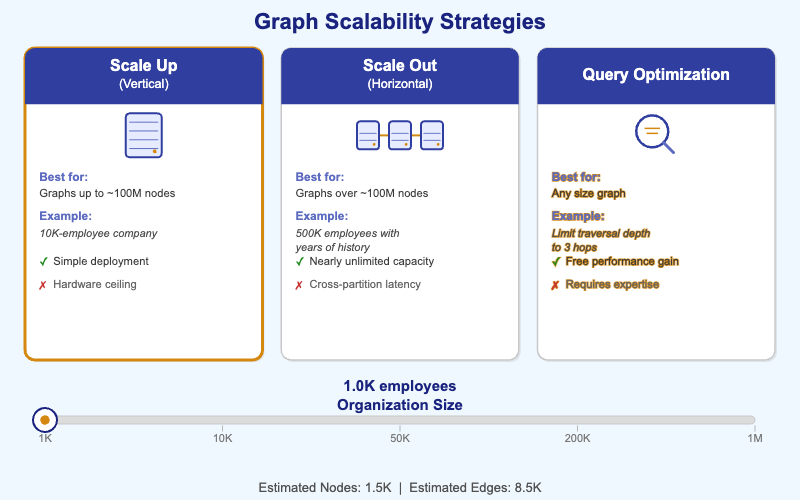

    Interactive infographic showing vertical scaling, horizontal scaling, and query optimization strategies for graph databases.

-   **[Hidden Achievement Detection Pipeline](./hidden-achievement-detection/index.md)**

    

    Interactive flowchart showing the five-stage pipeline for detecting hidden achievements through graph analysis of organizational communication networks.

-   **[HR Graph Data Model](./hr-graph-data-model/index.md)**

    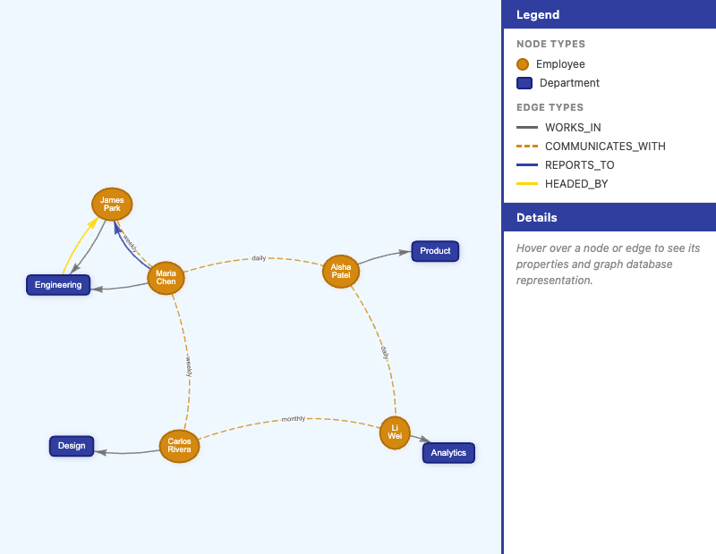

    An interactive graph visualization showing how employees, departments, and their relationships are modeled as nodes and edges in a graph database.

-   **[Idea Flow Network Visualization](./idea-flow-network/index.md)**

    

    Interactive force-directed graph showing how novel ideas travel through organizational communication networks, with innovation hubs and idea deserts.

-   **[Inclusion Network Map](./inclusion-network-map/index.md)**

    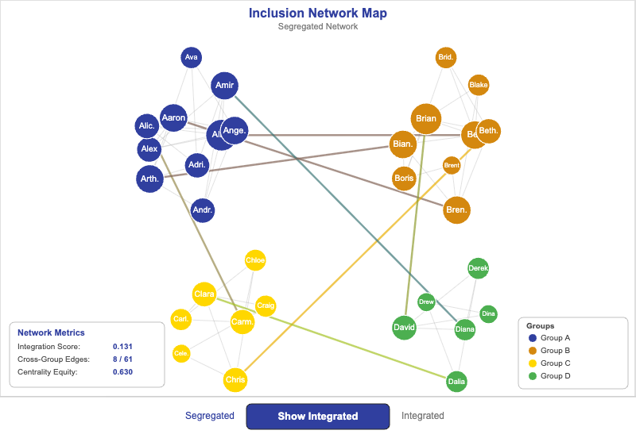

    Interactive force-directed graph comparing segregated and integrated communication networks with nodes colored by demographic group and inclusion metrics.

-   **[Index-Free Adjacency](./index-free-adjacency/index.md)**

    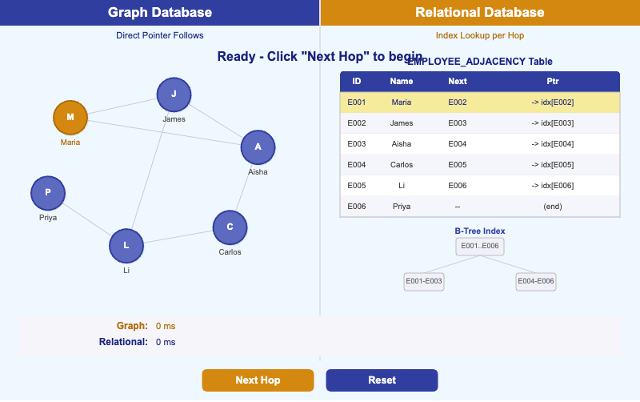

    Animated comparison of graph database pointer-based traversals vs relational database index lookups.

-   **[Influence Network Visualization](./influence-network/index.md)**

    

    Interactive force-directed graph revealing formal leaders, informal influencers, and bridge builders across a 35-employee organizational network using PageRank and betweenness centrality.

-   **[Learning Graph Viewer](./graph-viewer/index.md)**

    

    Interactive vis-network viewer for exploring the 200-concept course learning graph with search, category filtering, and real-time statistics.

-   **[Link Prediction Visualization](./link-prediction-viz/index.md)**

    

    Interactive organizational graph showing existing edges and predicted future edges using common neighbors, Jaccard, and Adamic-Adar scoring methods.

-   **[Louvain Community Detection](./louvain-community-detection/index.md)**

    

    Interactive visualization of the Louvain algorithm detecting communities in an organizational network.

-   **[Mentor-Mentee Matching Network](./mentor-matching-network/index.md)**

    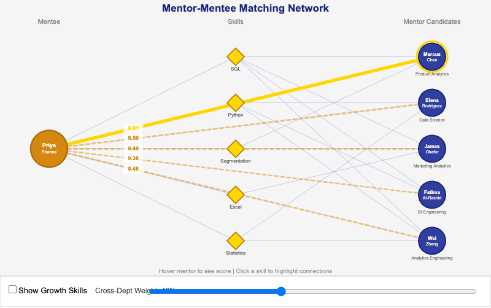

    Interactive bipartite graph visualization of mentor-mentee pairing with skill similarity, network proximity, and cross-departmental reach scoring.

-   **[Merger Integration Monitor](./merger-integration-monitor/index.md)**

    

    Animated force-directed graph showing cross-legacy communication evolution during an 18-month post-merger integration period.

-   **[ML Workflow Pipeline](./ml-workflow-pipeline/index.md)**

    

    Interactive six-stage machine learning workflow for organizational analytics with hover tooltips and click details.

-   **[Multi-Hop Query Performance](./multi-hop-performance/index.md)**

    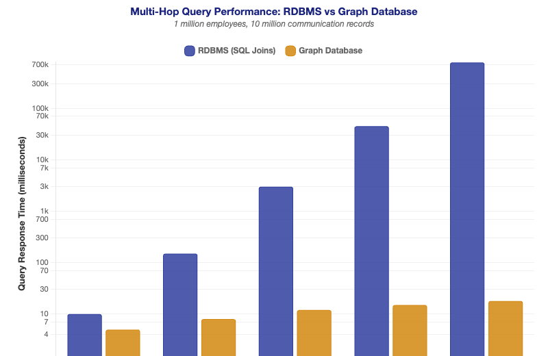

    An interactive grouped bar chart comparing RDBMS and graph database query performance as traversal depth increases from 1 to 5 hops.

-   **[Network Health Dashboard](./network-health-dashboard/index.md)**

    

    Three interactive gauges showing network density, average path length, and clustering coefficient with combined diagnostic assessment.

-   **[NLP Before & After](./nlp-before-after/index.md)**

    

    Side-by-side comparison of an organizational graph before and after NLP enrichment with sentiment, topic, and tone overlays.

-   **[NLP Enrichment Pipeline](./nlp-enrichment-pipeline/index.md)**

    

    Interactive visualization showing how raw text flows through NLP stages to produce graph-ready properties.

-   **[Normalization and Enrichment Pipeline](./normalization-pipeline/index.md)**

    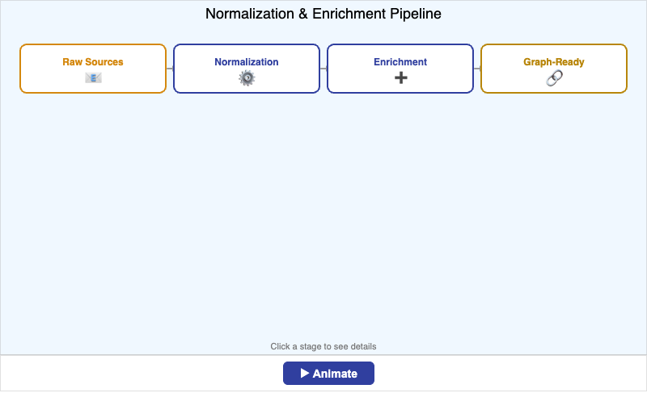

    Interactive pipeline diagram showing how raw events from diverse sources are normalized and enriched into graph-ready records.

-   **[Operational Report Wireframe](./operational-report-wireframe/index.md)**

    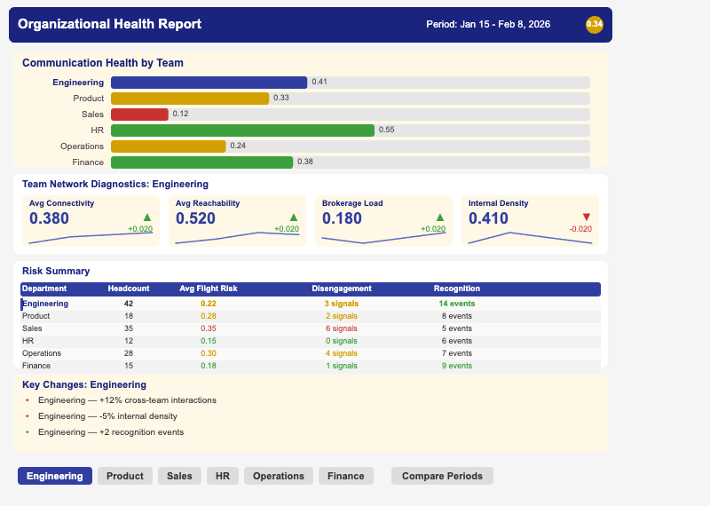

    Interactive five-section team report template showing communication health bars, network metric cards, risk tables, and period-over-period comparison for department-level monitoring.

-   **[Organizational Analytics Disciplines](./org-analytics-disciplines/index.md)**

    

    An interactive hub-and-spoke infographic showing the five contributing disciplines that form organizational analytics.

-   **[Organizational Health Score Dashboard](./org-health-score/index.md)**

    

    Interactive dashboard showing a composite organizational health score with circular gauge, radar chart, dimension bars, 12-month sparkline, and alerts panel.

-   **[Organizational Network Motifs](./organizational-motifs/index.md)**

    

    Visual gallery of five common organizational network motifs with interactive detail exploration.

-   **[Organizational Network Patterns](./network-patterns/index.md)**

    

    Interactive gallery of four common network motifs with animated detection and business impact descriptions.

-   **[Pathfinding Algorithms Visualizer](./pathfinding-visualizer/index.md)**

    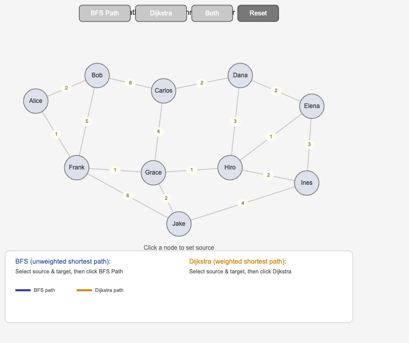

    Interactive comparison of unweighted BFS shortest path vs weighted Dijkstra shortest path.

-   **[Precision-Recall Tradeoff](./precision-recall-tradeoff/index.md)**

    

    Interactive visualization of how classification threshold affects precision, recall, and organizational consequences.

-   **[Process Discovery Flow](./process-discovery/index.md)**

    

    Interactive simulation showing how process discovery transforms raw event logs into a visual process map, highlighting deviations from the expected hiring process.

-   **[Property Graph Model](./property-graph-model/index.md)**

    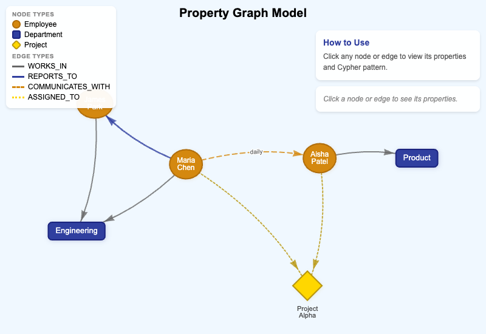

    Interactive property graph visualization showing employees, departments, and a project with inspectable properties on nodes and edges.

-   **[Relational Database Tables](./relational-db-tables/index.md)**

    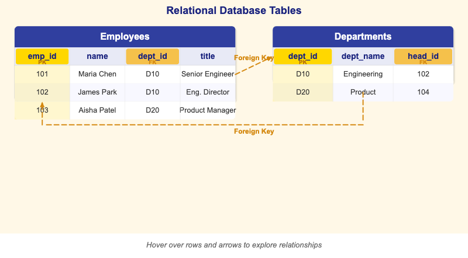

    Interactive diagram showing how relational databases use tables, rows, columns, and foreign keys to store and link organizational data.

-   **[Relational vs Graph Database](./relational-vs-graph/index.md)**

    

    Side-by-side interactive comparison showing how the same organizational question is represented and queried in a relational database versus a graph database.

-   **[Retention Priority Matrix](./retention-matrix/index.md)**

    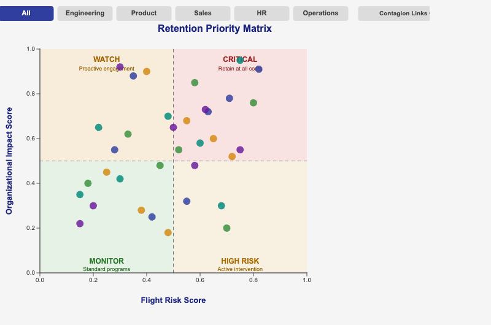

    Interactive 2x2 scatter plot mapping employees by flight risk and organizational impact, with department filtering and contagion link visualization for retention prioritization.

-   **[Retention Risk Pipeline](./retention-risk-pipeline/index.md)**

    

    Interactive left-to-right pipeline showing how graph metrics, NLP signals, and behavioral events feed into a composite retention risk model with contagion overlay.

-   **[Sentiment Analysis Demo](./sentiment-analysis-demo/index.md)**

    

    Interactive sentiment analysis with pre-loaded organizational messages, a sentiment gauge, and token-level scoring.

-   **[Silo Detection Dashboard](./silo-detection/index.md)**

    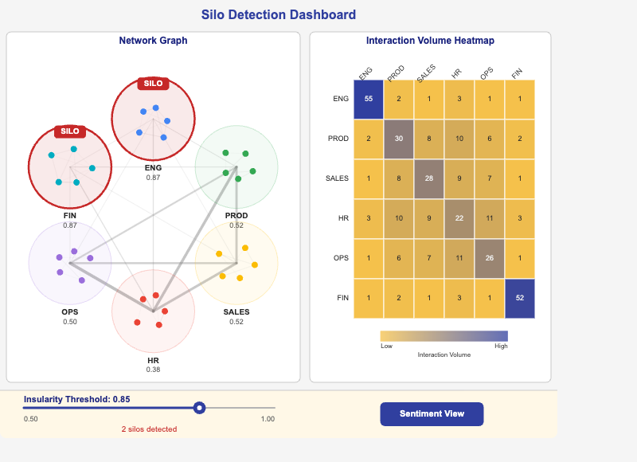

    Interactive network graph and department heatmap showing cross-team communication patterns, with adjustable insularity threshold to flag organizational silos.

-   **[Similarity Comparison](./similarity-comparison/index.md)**

    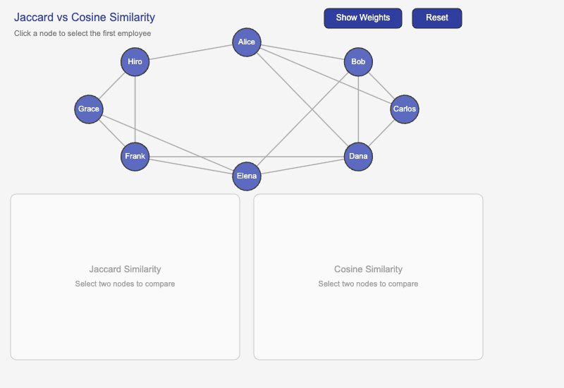

    Interactive comparison of Jaccard and cosine similarity for employee pairs in a weighted network.

-   **[Skill Gap Heatmap](./skill-gap-heatmap/index.md)**

    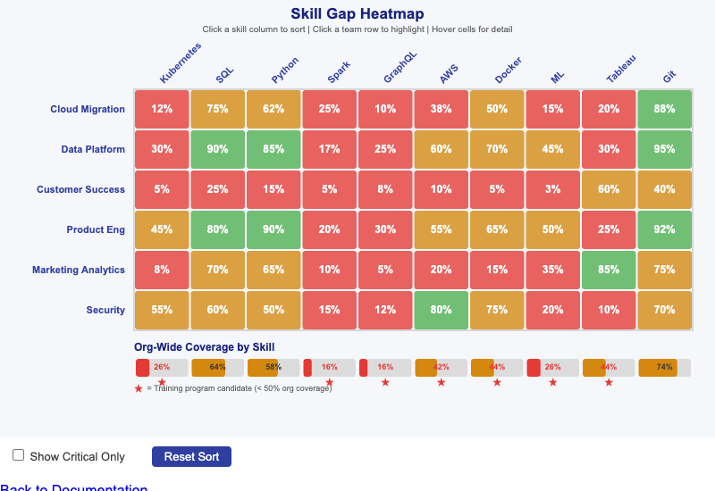

    Interactive heatmap showing skill coverage across teams, with cells colored by gap severity to help differentiate individual skill gaps from systemic training gaps.

-   **[Strategy Alignment Graph Model](./strategy-alignment-model/index.md)**

    

    Interactive three-layer graph visualization showing how individual tasks connect through projects to strategic objectives, with alignment strength indicators.

-   **[Subgraph Comparison](./subgraph-comparison/index.md)**

    

    Split-screen comparison of two department subgraphs with computed network metrics.

-   **[Summarization Pipeline](./summarization-pipeline/index.md)**

    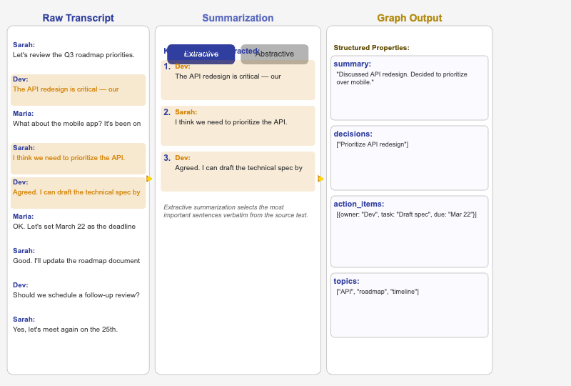

    Interactive three-column workflow showing raw meeting transcript through summarization to graph-ready structured output.

-   **[Task Assignment Optimization Flow](./task-assignment-flow/index.md)**

    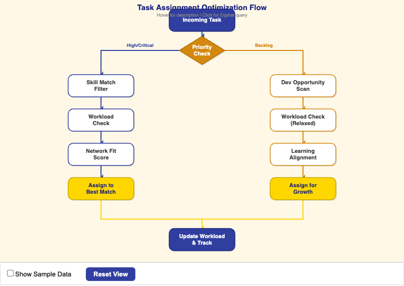

    Interactive flowchart showing how task assignment decisions balance skill match, workload capacity, and employee development goals using graph-based optimization.

-   **[Trend Analysis Dashboard](./trend-analysis-dashboard/index.md)**

    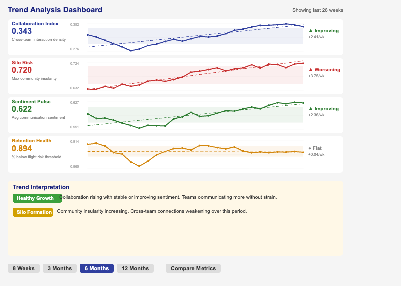

    Four-metric time series dashboard with linear regression trends, confidence bands, and compound trend interpretation for detecting fragmentation, burnout, and recovery patterns.

-   **[Vulnerability Assessment Flow](./vulnerability-assessment/index.md)**

    

    Interactive flowchart showing the step-by-step organizational vulnerability assessment process using graph analytics.

-   **[Word Embedding Space](./word-embedding-space/index.md)**

    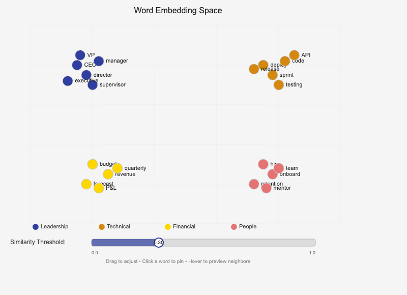

    2D scatter plot of word embeddings showing organizational vocabulary clustered by semantic meaning.

